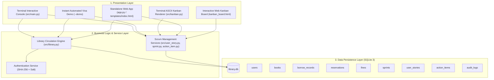
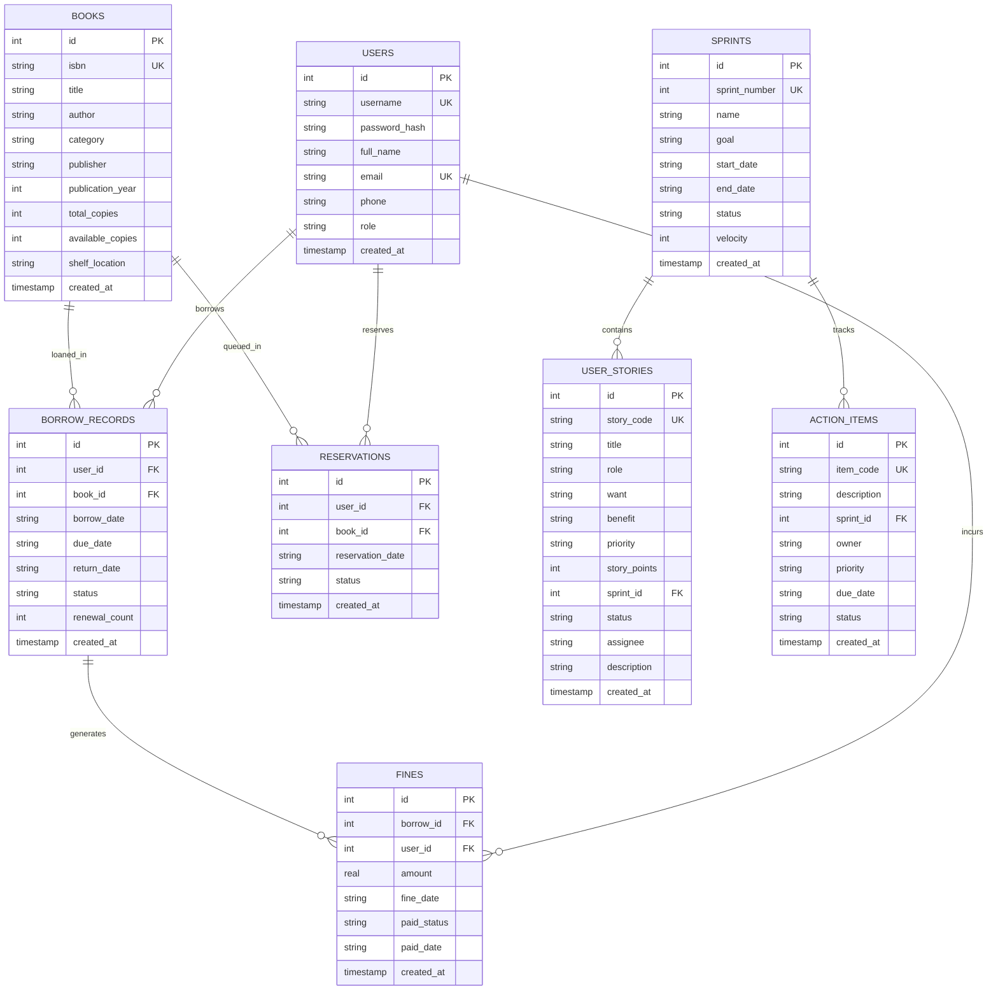

# System Design & Architecture
## Library Management System using Scrum Agile Methodology

---

## 1. Architectural Overview

The **Library Management System** is engineered following a clean **3-Tier Layered Architecture** with strict decoupling between the user interface, business logic domain services, and database persistence layers:

---

## 2. Entity Relationship Diagram (ERD)

---

## 3. Core Circulation Sequence Diagrams

### A. Atomic Book Borrowing Sequence

```mermaid
sequenceDiagram
    autonumber
    actor Member as Student Member
    participant Lib as LibraryService
    participant DB as SQLite (library.db)

    Member->>Lib: borrow_book(user_id, book_id)
    Lib->>DB: Check unpaid fines for user_id
    DB-->>Lib: Unpaid fines = ₹0.00
    Lib->>DB: Check active loans count for user_id
    DB-->>Lib: Active loans count = 1 (< 3 quota)
    Lib->>DB: SELECT available_copies FROM books WHERE id = book_id
    DB-->>Lib: available_copies = 3 (> 0)
    
    rect rgb(20, 35, 45)
        note over Lib, DB: Atomic SQLite Transaction
        Lib->>DB: UPDATE books SET available_copies = available_copies - 1 WHERE id = book_id AND available_copies > 0
        Lib->>DB: INSERT INTO borrow_records (user_id, book_id, borrow_date, due_date, status)
        Lib->>DB: INSERT INTO audit_logs (BOOK_BORROW)
        Lib->>DB: COMMIT TRANSACTION
    end

    Lib-->>Member: Return Borrow Confirmation (Due: 14 days)
```

### B. Book Return & Automated Overdue Fine Sequence

```mermaid
sequenceDiagram
    autonumber
    actor Member as Student / Librarian
    participant Lib as LibraryService
    participant DB as SQLite (library.db)

    Member->>Lib: return_book(borrow_id)
    Lib->>DB: SELECT * FROM borrow_records WHERE id = borrow_id
    DB-->>Lib: Borrow record found (due_date, book_id, user_id)
    
    rect rgb(20, 35, 45)
        note over Lib, DB: Atomic Inventory & Penalty Recovery
        Lib->>DB: UPDATE borrow_records SET status = 'Returned', return_date = now
        Lib->>DB: UPDATE books SET available_copies = available_copies + 1
        alt If now > due_date
            Lib->>Lib: Calculate late fine = overdue_days * ₹5.0
            Lib->>DB: INSERT INTO fines (borrow_id, user_id, amount, paid_status='Unpaid')
        end
        Lib->>DB: Check pending reservations on book_id
        opt Pending reservation exists
            Lib->>DB: UPDATE reservations SET status = 'Fulfilled' WHERE id = res_id
        end
        Lib->>DB: INSERT INTO audit_logs (BOOK_RETURN)
        Lib->>DB: COMMIT TRANSACTION
    end

    Lib-->>Member: Return Summary (overdue_days, fine_amount, reservation_alert)
```

---

## 4. Database Schema Specifications & Data Dictionary

| Table Name | Purpose | Primary Key | Foreign Keys | Key Constraints |
|---|---|---|---|---|
| `users` | Stores accounts & roles | `id` | None | `username UNIQUE`, `email UNIQUE`, `role IN ('member', 'librarian', 'admin')` |
| `books` | Physical textbook catalog | `id` | None | `isbn UNIQUE`, `available_copies >= 0`, `total_copies >= 0` |
| `borrow_records` | Circulation loan transactions | `id` | `user_id` -> `users.id`, `book_id` -> `books.id` | `status IN ('Borrowed', 'Returned', 'Overdue')` |
| `reservations` | Out-of-stock hold queue | `id` | `user_id` -> `users.id`, `book_id` -> `books.id` | `status IN ('Pending', 'Fulfilled', 'Cancelled')` |
| `fines` | Overdue penalty ledger | `id` | `borrow_id` -> `borrow_records.id`, `user_id` -> `users.id` | `paid_status IN ('Unpaid', 'Paid')`, `amount >= 0` |
| `sprints` | Scrum 5-week sprint schedule | `id` | None | `sprint_number UNIQUE`, `status IN ('Planning', 'Active', 'Completed')` |
| `user_stories` | Product & Sprint backlogs | `id` | `sprint_id` -> `sprints.id` | `story_code UNIQUE`, MoSCoW priorities, INVEST attributes |
| `action_items` | Weekly task register | `id` | `sprint_id` -> `sprints.id` | `item_code UNIQUE`, Kanban workflow statuses |
| `audit_logs` | System security event ledger | `id` | `user_id` -> `users.id` | Append-only event history |
